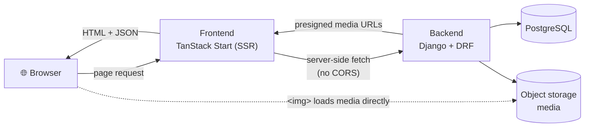

# Blog

A small, calm personal blog — a Django REST API backend and a server-rendered
TanStack Start (React) frontend, deployable together with Docker Compose.

## Architecture



- The frontend's **server functions** call the API server-to-server, so the
  browser never talks to Django directly — **no CORS needed**.
- The browser loads **media images** directly from object storage via presigned
  URLs returned by the API.

## Tech stack

| | |
|---|---|
| **Backend** | Django 6, Django REST Framework, PostgreSQL, `uv`, Python 3.13 |
| **Frontend** | TanStack Start + Router, React 19, Vite, TypeScript, CSS Modules |
| **Media** | `django-storages` + S3-compatible object storage (presigned URLs) |
| **Static** | WhiteNoise (admin / DRF browsable API) |
| **Serving** | gunicorn (backend), nitro node-server (frontend) |
| **Dev/Deploy** | Docker Compose |

## Project layout

```
.
├── backend/            Django project (API + admin)
│   ├── blog/           settings, urls, wsgi
│   ├── posts/          Post, Category, Tag — models, serializers, viewsets, admin
│   ├── pages/          AboutPage + ensure_superuser management command
│   └── Dockerfile
├── frontend/           TanStack Start app
│   └── src/
│       ├── routes/     /, /posts, /posts/$slug, /about, __root
│       ├── components/ Navbar, ThemeToggle, Post, PostCard, PostGrid,
│       │               CategoryFilter, About
│       ├── lib/        api client, theme + posts helpers
│       └── styles.css  global design tokens (light/dark) + base styles
├── docker-compose.yml
└── .env.example        compose / backend environment
```

## Quick start (Docker)

```bash
cp .env.example .env          # set SECRET_KEY, DB_PASSWORD, superuser, etc.
docker compose up --build
```

- Frontend → http://localhost:3000
- API → http://localhost:8000/api/
- Admin → http://localhost:8000/admin/

On first boot the backend runs migrations, creates the superuser from
`DJANGO_SUPERUSER_*` (idempotent), collects static, and starts gunicorn.

## Quick start (manual)

**Backend** (needs a running PostgreSQL):

```bash
cd backend
uv sync
cp .env.example .env          # edit values
uv run python manage.py migrate
uv run python manage.py createsuperuser
uv run python manage.py runserver        # :8000
```

**Frontend:**

```bash
cd frontend
npm install
cp .env.example .env          # API_URL=http://localhost:8000
npm run dev                   # :3000
```

## API

Base path `/api/` (browsable API enabled; read-only for anonymous users,
write requires auth via `IsAuthenticatedOrReadOnly`; 20 items/page).

| Endpoint | Lookup | Resource |
|---|---|---|
| `/api/posts/`, `/api/posts/<slug>/` | slug | Posts (with nested categories & tags) |
| `/api/categories/`, `/api/categories/<slug>/` | slug | Categories |
| `/api/tags/`, `/api/tags/<slug>/` | slug | Tags |
| `/api/about/`, `/api/about/<id>/` | pk | About page (singleton) |

## Frontend routes

| Route | Page |
|---|---|
| `/` | Home — hero + latest posts |
| `/posts` | All posts, filterable by `?category=<slug>` |
| `/posts/$slug` | Post detail (Markdown body) |
| `/about` | About page |

Theme is light / dark / **auto** (system), toggled from the navbar and persisted
in `localStorage`. The palette lives as design tokens in `src/styles.css`.

## Configuration

All config is environment-driven. See `.env.example` (root, for Compose) and
`backend/.env.example` / `frontend/.env.example` for the full list. Key vars:

| Var | Purpose |
|---|---|
| `SECRET_KEY`, `DEBUG`, `ALLOWED_HOSTS`, `CSRF_TRUSTED_ORIGINS` | Django core |
| `DB_*` | PostgreSQL connection |
| `DJANGO_SUPERUSER_*` | Auto-created admin user (idempotent) |
| `USE_S3` + `AWS_*` | Media object storage (see below) |
| `API_URL` (frontend) | Backend base URL for server-side fetches |

## Production notes

- Set `DEBUG=false`. Security hardening (HTTPS redirect, HSTS, secure cookies,
  `X-Frame-Options`, proxy SSL header) is then applied automatically.
- **Media** must use object storage in production (`USE_S3=true`). With the
  default `AWS_QUERYSTRING_AUTH=true`, the bucket stays private and image URLs
  are **presigned/expiring** (SigV4). Set `AWS_QUERYSTRING_AUTH=false` for a
  public bucket + CDN. See [`backend/README.md`](backend/README.md) for details.
- Run `python manage.py check --deploy` before shipping.

## Common commands

```bash
# Backend (from backend/)
uv run python manage.py makemigrations
uv run python manage.py migrate
uv run python manage.py ensure_superuser        # idempotent, from env
uv run python manage.py check --deploy

# Frontend (from frontend/)
npm run dev                 # dev server
npm run build               # production build (.output/)
npm run generate-routes     # regenerate the route tree
npx tsc --noEmit            # typecheck
```

See [`backend/README.md`](backend/README.md) for backend deployment specifics.
